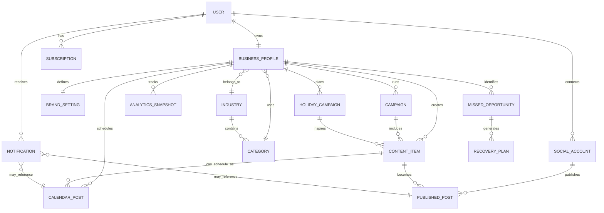

# AI Marketing Automation System Overview

## What This System Is

This project is a frontend prototype for an AI-driven marketing automation SaaS for small businesses and SMEs. It is designed to help a business owner go from account creation to onboarding, then into a marketing workspace where they can generate content, schedule posts, publish to social platforms, review analytics, and manage seasonal campaigns.

The current codebase is a React + Vite application with route-based screens and static UI state. It does not yet include a backend, database, or real API integration, so the data model below is a conceptual ERD based on the product flow shown in the UI.

## High-Level Architecture

The app is organized as a single-page application with routed sections:

1. Public-facing landing and authentication pages.
2. A multi-step onboarding wizard for business setup.
3. A protected application shell with a sidebar and top bar.
4. Feature pages for AI generation, content management, publishing, scheduling, analytics, notifications, and account settings.

### Entry Flow

- [src/app/App.tsx](src/app/App.tsx) mounts the router.
- [src/app/routes.tsx](src/app/routes.tsx) defines every public and app route.
- [src/app/components/layout/MainLayout.tsx](src/app/components/layout/MainLayout.tsx) wraps the authenticated app area with navigation and shared layout.

## Route Map

### Public Routes

- `/` shows the landing page.
- `/login` shows the login screen.
- `/register` shows registration.
- `/subscribe` shows subscription plan selection.

### Onboarding Routes

- `/onboarding/industry` selects the business industry.
- `/onboarding/category` selects the business category.
- `/onboarding/profile` captures business profile details.
- `/onboarding/brand` captures brand tone and marketing goals.
- `/onboarding/social` connects social media accounts.

### Application Routes

- `/app` opens the dashboard.
- `/app/ai-generator` generates AI content.
- `/app/content-studio` manages content assets.
- `/app/campaigns` manages marketing campaigns.
- `/app/calendar` shows the content calendar.
- `/app/publishing` handles post creation and publishing.
- `/app/analytics` shows engagement and performance analytics.
- `/app/notifications` shows alerts and updates.
- `/app/holiday-marketing` focuses on seasonal campaigns.
- `/app/missed-posts` recovers missed posting opportunities.
- `/app/profile` manages the business profile.
- `/app/settings` manages account, AI, integrations, and API preferences.

## User Flow

### 1. Discovery and Conversion

The landing page explains the product value: AI content generation, smart scheduling, analytics, multi-platform publishing, campaign management, and holiday marketing. It pushes users toward register or login, and it also presents plan tiers through the pricing section.

### 2. Authentication

Users can sign in, register, or choose a subscription plan. The subscription page acts as a pricing gate where a user picks a plan before proceeding into the product experience.

### 3. Onboarding Wizard

The onboarding sequence gathers the minimum business context needed to personalize AI output:

- Industry selection.
- Business category selection.
- Business profile details.
- Brand tone and marketing goal.
- Social account connection.

This flow is important because it seeds the downstream AI prompts, content suggestions, and analytics assumptions.

### 4. Main Workspace

After onboarding, the user lands inside the main dashboard shell. From there they can:

- Generate copy and campaign ideas.
- Build and edit content.
- Schedule posts in a calendar.
- Publish to social platforms.
- Track engagement and reach.
- Review missed post opportunities.
- Manage profile, settings, and integrations.

### 5. Feedback and Optimization Loop

The system is designed as a closed loop:

business setup -> AI content creation -> scheduling/publishing -> analytics -> recovery and optimization.

That loop is visible in the dashboard widgets, analytics page, missed post recovery page, and holiday marketing tools.

## Functional Modules

### Dashboard

The dashboard summarizes core business metrics such as posts, scheduled posts, engagement rate, reach, follower growth, and missed promotions. It also surfaces charts, upcoming posts, holiday suggestions, and AI recommendations.

### AI Generator

The AI generator takes a product or service name, description, target audience, tone, platform, and optional holiday/event context. It then returns a caption, hashtags, call to action, and campaign idea. In the current UI this is simulated with local state, but the intended design is clearly AI-assisted content generation.

### Content Studio

This area acts as a content library and asset management hub. The current UI only shows summary cards and a placeholder content library state, but the intended module is to store drafts, templates, published content, and organized assets.

### Campaigns

Campaigns group posts into planned marketing initiatives. The UI shows active, scheduled, and completed campaigns with reach and engagement metrics.

### Calendar Scheduler

The calendar shows scheduled, published, missed, and holiday-related posts across a monthly timeline. This is the planning layer that links content creation to execution.

### Social Publishing

Publishing combines platform selection, media upload, caption writing, scheduling, draft saving, and immediate publishing. This is the operational step where content becomes a live social post.

### Analytics

Analytics tracks engagement, likes, comments, shares, platform split, best posting times, and top-performing posts. This page is the main measurement layer for campaign optimization.

### Notifications

Notifications represent system events such as successful publishing, missed opportunities, milestones, and reminders.

### Holiday Marketing

Holiday marketing is a planning and recommendation module for seasonal campaigns. It provides upcoming holidays, predicted engagement, AI campaign ideas, and reusable seasonal templates.

### Missed Post Recovery

This feature identifies missed promotional opportunities and proposes recovery plans. It is a corrective layer that helps the user recover reach and engagement loss.

### Profile and Settings

Profile stores the business identity, connected social accounts, and high-level activity metrics. Settings controls account data, security, notifications, AI behavior, theme preferences, social integrations, and API access.

## Conceptual ERD

The following ERD is inferred from the screens and the product flow. It reflects how a backend would likely be structured if this prototype were turned into a real application.

## ERD Entity Notes

### User

Represents the account owner or marketing operator. In a future backend, this would store login credentials, role, and account status.

### Business Profile

Stores the business identity used to personalize the AI system. It is the central entity that connects onboarding data to the rest of the product.

### Industry and Category

Industry is the broad classification selected in onboarding. Category is the more specific business type derived from that industry.

### Brand Setting

Stores tone and marketing goals such as professional, friendly, luxury, trendy, fun, sales, engagement, product promotion, or follower growth.

### Social Account

Represents connected publishing destinations such as Facebook or Instagram.

### Content Item

Represents AI-generated or manually created marketing content. This would typically include caption text, hashtags, CTA, media references, and status such as draft or ready to publish.

### Campaign

Represents a grouped marketing initiative like a seasonal sale, launch, or holiday promotion.

### Calendar Post

Represents scheduled execution of content on a specific date and time.

### Published Post

Represents the live post after publishing to one or more connected accounts.

### Analytics Snapshot

Stores metrics collected over time, such as reach, engagement, likes, comments, shares, and performance by platform.

### Holiday Campaign

Represents seasonal planning objects for events such as Mother’s Day, Memorial Day, and Independence Day.

### Missed Opportunity and Recovery Plan

Represents posts or campaigns that were not published on time and the AI-generated recovery recommendations for them.

### Notification

Represents alerts about publishing, scheduling, milestones, reminders, and missed opportunities.

### Subscription

Represents the billing plan selected by the user, such as Starter, Growth, or Enterprise.

## Data Flow

The likely data flow is:

1. User registers or logs in.
2. User completes onboarding, which creates or updates business profile data.
3. Business profile data personalizes AI generation and dashboard suggestions.
4. User generates content in the AI generator or content studio.
5. Generated content is saved as a draft or moved into the calendar scheduler.
6. Scheduled content is published to connected social accounts.
7. Published activity feeds analytics and notifications.
8. Analytics and missed post detection feed the optimization and recovery features.

## Current Implementation Notes

- Most pages are static mockups with local component state only.
- Navigation is fully route-driven.
- The layout uses a persistent sidebar and top bar in the app section.
- Charts on the dashboard and analytics pages are presentational and use hard-coded sample data.
- Several buttons are visual placeholders and do not yet call a backend service.

## Suggested Real Backend Schema

If this prototype becomes a production system, the core backend tables would likely include:

- users
- subscriptions
- business_profiles
- industries
- categories
- brand_settings
- social_accounts
- content_items
- campaigns
- calendar_posts
- published_posts
- analytics_snapshots
- holiday_campaigns
- missed_opportunities
- recovery_plans
- notifications

## Summary

This system is a polished SaaS-style AI marketing assistant for SMEs. Its main purpose is to guide a business from setup to automated content creation, scheduling, publishing, and analytics, with holiday planning and missed-post recovery built into the same workflow. The UI already expresses a clear end-to-end product model, and the ERD above captures the backend structure that would naturally support it.